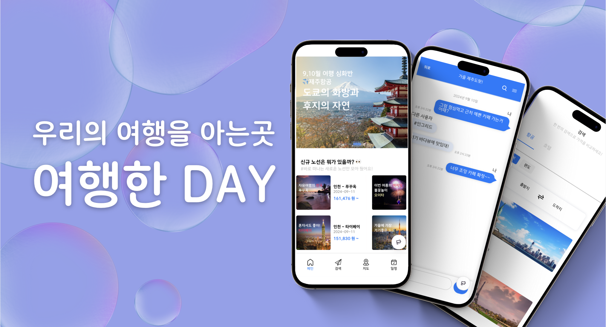

# 안녕하세요! 프론트엔드 개발자 전연주입니다

저는 프론트엔드 개발자로서, 사용자 경험을 최우선으로 생각하며 효율적이고 직관적인 UI를 만드는 것을 목표로 하고 있습니다. 🖥️

---

## 🛠️ 기술 스택

  
  
  
  
  

---

## 📈 프로젝트
- **여행한DAY**: 여행 일정을 관리하고, 친구들과 실시간 채팅 및 비용 정산을 할 수 있는 서비스입니다.
- **어드레**: 음성 리뷰작성 및 검색 서비스입니다.
- **CollieLand**: 보더 콜리 정보를 공유하는 커뮤니티 서비스입니다.
- **뭐먹으카**: 제주도 착한식당을 검색할 수 있는 서비스입니다.

  
  

  
  

---

## 🌱 최근 관심사
- 사용자 친화적인 UI/UX
- 성능 최적화와 효율적인 상태 관리

---

## 📫 연락처
- **Email**: duswn700437@gmail.com
- **GitHub**: [github.com/collie-jun](https://github.com/collie-jun)

 
  

